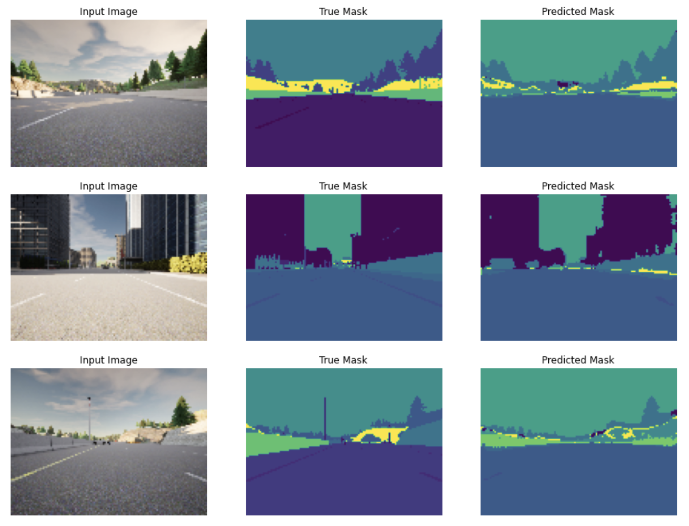

# Unet: Semantic image segmentation
We build our own [U-Net](https://arxiv.org/abs/1505.04597), a type of CNN designed for quick, precise image segmentation. We will use it to predict a label for every single pixel in an image - in this case, an image from a self-driving car dataset. This type of image classification is called semantic image segmentation. It's similar to object detection in that both ask the question: "What objects are in this image and where in the image are those objects located?." Whereas object detection labels objects with bounding boxes that may include pixels that aren't part of the object, semantic image segmentation allows you to predict a precise mask for each object in the image by labeling each pixel in the image with its corresponding class. The word “semantic” here refers to what's being shown, so for example the “car” class is indicated below by the dark blue mask, and "person" class is indicated with a red mask:

### Dataset
We have 1060 pictures of road, such as what would be seen by a camera on a self-driving car, in two different forms: RGB images and mask images. The mask images represent the true segmentation using different colors assigned to each pixel based on the object class of the pixel. The figure below shows an example of such two images for one picture.

### U-Net architecture
U-Net has an architecture is a CNN that looks like a U shape and consists of a contracting path (downsampling encoder), crop path, expanding path (upsampling decoder), and final feature-mapping block, as shown below:

With 40 epochs of training we used the U-Net to predict the mask, representing the results of pixel-wise segmentation. Some examples to compare the predicted mask to the true mask:

